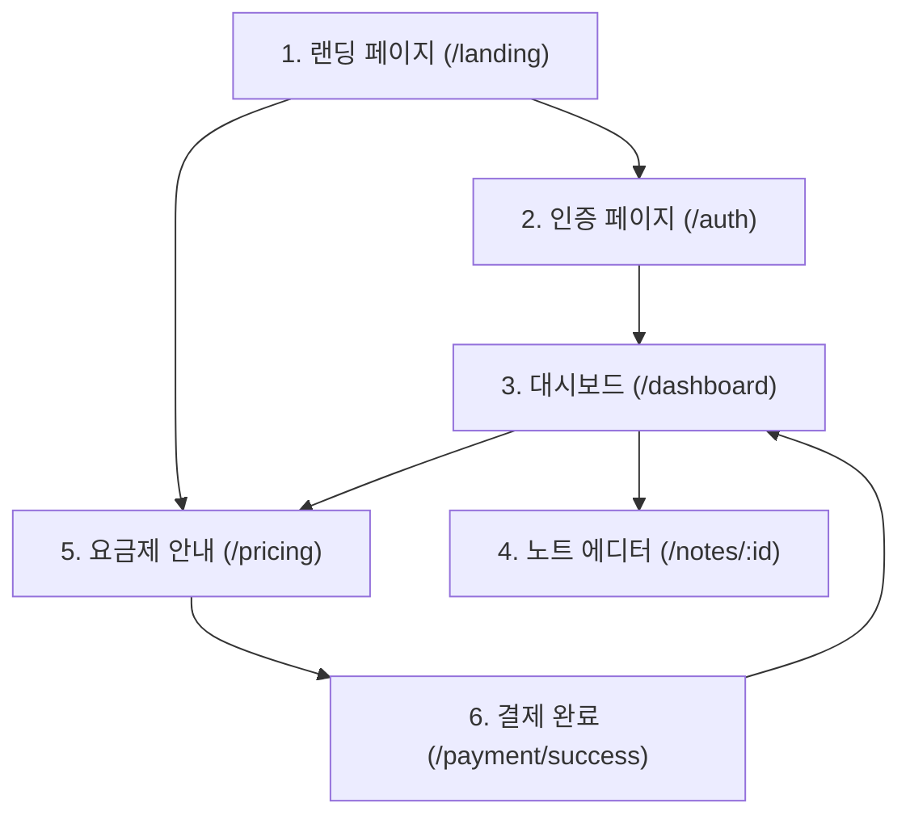
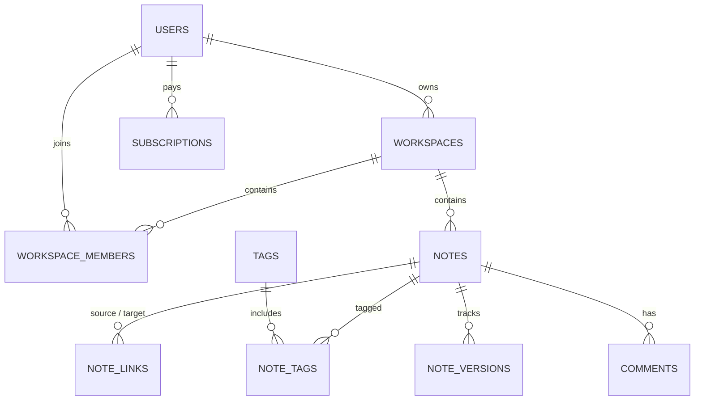
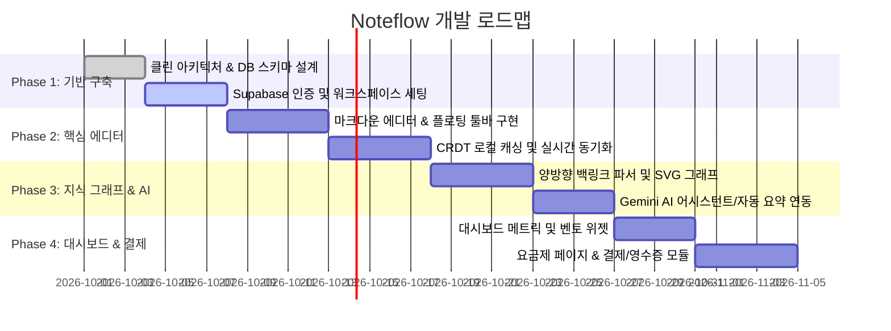

# Noteflow 서비스 상세 기획 및 아키텍처 컨텍스트 (service.md)

---

## 1. 서비스 개요 (Service Overview)

### 1.1 서비스 소개
**Noteflow(노트플로우)**는 개인과 팀의 복잡한 생각과 흩어진 영감을 유기적으로 연결하고 실행 계획으로 전환해 주는 **차세대 지능형 클라우드 마크다운 워크스페이스(Intelligent Personal Knowledge Base & Second Brain)**입니다.

- **브랜드 슬로건:** 
  - *"생각이 흐르는 곳, 스마트한 클라우드 메모의 시작"*
  - *"흩어진 영감을 하나의 흐름으로 완성하세요."*
- **핵심 타겟:**
  - 지식 노동자, 프로덕트 매니저(PM), 연구원, 개발자, 기획자, 스타트업 및 혁신 기업 팀원

### 1.2 핵심 가치 제안 (Core Value Propositions)
1. **로컬 퍼스트 & 초고속 동기화 (Local-First & Instant Sync):**
   - 35ms 미만의 인체감 렌더링 지연율, 오프라인 환경 완벽 작성 지원.
   - 온라인 복구 시 충돌 없는 CRDT(Conflict-free Replicated Data Type) 기반 실시간 동기화.
2. **자율 지능형 AI 어시스턴트 (Context-Aware AI Assistant):**
   - 비정형 텍스트/회의록 3초 핵심 요약, 액션 아이템 자동 추출, 시맨틱 연관 태깅, 자연어 질의응답.
3. **양방향 백링크 & 지식 그래프 (Bi-directional Backlinks & Knowledge Mesh):**
   - 고립된 폴더 구조를 넘어 뇌 신경망처럼 상호 참조(`[[노트명]]`)를 시각화하는 인터랙티브 3D/2D 지식 그래프.
4. **엔터프라이즈 보안 및 협업 (Enterprise-Grade Security & Collaboration):**
   - 엔드투엔드 암호화(E2EE), 실시간 동시 편집, 세분화된 워크스페이스/역할 권한, SAML/SSO 연동.

---

## 2. 디자인 시스템 및 UI/UX 원칙 (Design System & Aesthetics)

### 2.1 색상 토큰 (Color Palette)
| 역할 | 토큰명 | 색상 코드 (Hex) | 용도 및 설명 |
| :--- | :--- | :--- | :--- |
| **Primary** | `primary` | `#3525cd` | 주 브랜드 컬러 (버튼, 활성 탭, 주요 아이콘) |
| **Primary Container** | `primary-container`| `#4f46e5` | 강조 영역 및 인터랙티브 호버 배경 |
| **Secondary** | `secondary` | `#6b38d4` | 보조 액센트 컬러 (AI 기능, 중요 뱃지) |
| **Tertiary** | `tertiary-container` | `#006e4b` / `#6ffbbe` | 성공, 실시간 동기화 완료, 긍정 상태 |
| **Surface** | `surface` | `#f8f9ff` | 기본 배경색 (부드러운 클라우드 블루 톤) |
| **Surface Lowest** | `surface-container-lowest` | `#ffffff` | 카드 및 캔버스 배경 |
| **On-Surface** | `on-surface` | `#0b1c30` | 기본 텍스트 (다크 네이비 톤의 뛰어난 가독성) |
| **Outline** | `outline-variant` | `#c7c4d8` | 디바이더 및 보더 라인 |

### 2.2 타이포그래피 (Typography)
- **Primary Font:** `Inter` (UI 텍스트, 헤드라인, 라벨 전반)
- **Code Font:** `JetBrains Mono` (코드 블록, 단축키, 메타데이터 수치, 시스템 로그)
- **Icon Set:** `Material Symbols Outlined` (가변 폰트 weight & fill 지원)

### 2.3 인터랙션 및 마이크로 인터랙션
- 백드롭 블러(`backdrop-blur-xl`), 은은한 앰비언트 글로우(Ambient Glow) 배경.
- 키보드 단축키 퍼스트: `⌘K` (빠른 검색), `⌘N` (새 노트 생성), `/` (슬래시 커맨드 에디터).
- 활성 상태 실시간 펄스 인디케이터(Live Ping Animation).

---

## 3. 페이지별 화면 구성 및 기능 명세 (Screen Specifications)



### 3.1 랜딩 페이지 (`landing.html`)
* **목적:** 서비스 가치 전달, 소셜 프루프 제시 및 무료 가입/체험 전환 유도
* **주요 구성 요소:**
  1. **헤더 & GNB:** Noteflow 로고, 제품 기능/템플릿/요금제/엔터프라이즈 내비게이션, 로그인/무료 시작하기 버튼.
  2. **히어로 섹션:** 
     - 신규 버전 릴리즈 뱃지 (`Noteflow 3.0 출시 • AI 어시스턴트 탑재`)
     - 메인 헤드라인 & 서브카피
     - 듀얼 CTA (`무료로 시작하기`, `인터랙티브 데모 체험`)
     - 신뢰 지표 (50,000+ 사용자, 5점 만점 평점)
  3. **인터랙티브 워크스페이스 목업 캔버스:**
     - 3분할 뷰: 좌측 문서 트리 & 태그 / 중앙 마크다운 라이브 에디터 / 우측 지식 백링크 그래프 및 AI 요약 카드
     - 오프라인 캐시 게이지(100%), 실시간 동시 편집자 표시
  4. **핵심 기능 3-컬럼 벤토 그리드:**
     - 실시간 클라우드 동기화 (12ms 지연율, E2EE)
     - 스마트 AI 어시스턴트 (문맥 추천, 의미적 연관도 분석)
     - 양방향 백링크 & 지식 그래프 (2,419 노드 밀도)
  5. **사용자 추천사 (Testimonial Carousel):** PM, AI 연구원, 시니어 엔지니어 후기.
  6. **하단 고전환 CTA 배너:** 신용카드 등록 없는 14일 무료 트라이얼, 이메일 입력 가입 폼, 노션/옵시디언 마이그레이션 안내.

---

### 3.2 인증 및 온보딩 페이지 (`auth.html`)
* **목적:** 회원가입, 로그인 및 소셜 계정 연동을 통한 워크스페이스 진입
* **주요 구성 요소:**
  1. **좌측 브랜딩 패널:** 
     - Noteflow 핵심 가치 및 3대 핵심 기능 (자동 실시간 동기화, 엔드투엔드 암호화, 크로스 디바이스 연동)
     - 고객 추천사(Testimonial) 인용구
  2. **우측 인증 폼 패널:**
     - 상단 탭 스위처: `로그인` vs `회원가입`
     - 소셜 간편 로그인 (Google, GitHub, Apple OAuth 2.0)
     - 이메일/비밀번호 입력 폼
     - 동적 입력 필드: 회원가입 시 `이름(닉네임)` 및 `약관 동의` 체크박스 노출
     - 비밀번호 표시/숨김 토글(`visibility` 아이콘)
     - 로그인 유지(30일) 체크박스 및 비밀번호 찾기 링크

---

### 3.3 대시보드 페이지 (`dashboard.html`)
* **목적:** 사용자의 전체 노트 및 워크스페이스 현황 관리, 빠른 작성과 탐색 지원
* **주요 구성 요소:**
  1. **좌측 글로벌 사이드바:**
     - 워크스페이스 선택기 (`개인 워크스페이스`, `팀 워크스페이스`)
     - 빠른 검색 (`Quick Find - ⌘K`)
     - 메뉴 트리: 대시보드, 빠른 메모, 프로젝트 노트, 즐겨찾기, 템플릿, 휴지통
     - 스토리지 사용량 게이지 (예: `4.2GB / 15GB`) & Pro 업그레이드 버튼
     - 사용자 프로필 및 환경설정 바로가기
  2. **상단 웰컴 & 통계 섹션:**
     - 사용자 인사말 & 플랜 상태 뱃지 (`Pro 플랜 활성`)
     - 메트릭 카드: 전체 노트(128), 즐겨찾기(14), 공유 워크스페이스(6), 이번 주 신규 메모(+18)
     - 퀵 액션: `AI 요약 브리프`, `+ 새 노트 만들기 (⌘N)`
  3. **상단 3분할 벤토 위젯:**
     - **빠른 스크래치패드:** 제목 없이 즉시 작성, 실시간 자동 저장, 정식 노트 전환 버튼
     - **스마트 지식 어시스턴트:** 작성 중인 문서의 빈 섹션 감지 및 연관 노트 추천
     - **이번 주 태스크 달성도:** SVG 도넛 차트(78% 완료) 및 액션 아이템 목록
  4. **메인 콘텐츠 영역 (노트 브라우징):**
     - 탭 필터 (전체 노트, 즐겨찾기, 팀 공유, 보관함)
     - 검색창, 정렬(최근 수정순), 뷰 모드 전환(그리드 뷰 vs 리스트 뷰)
     - 노트 카드: 태그 뱃지, 즐겨찾기 별 토글, 제목, 3줄 미리보기, 이미지 첨부 썸네일 / 코드 스니펫 미리보기, 공동 작업자 아바타, 읽기 소요 시간
  5. **우측 유틸리티 패널:**
     - 인터랙티브 미니 지식 네트워크 그래프 (확대/축소, 중앙 정렬 컨트롤)
     - 실시간 협업 피드 (댓글, 버전 복원, 멤버 초대 등 타임라인 로그)

---

### 3.4 노트 상세 및 마크다운 에디터 (`note.html`)
* **목적:** 방해 없는(Distraction-Free) 고성능 마크다운 문서 작성 및 AI 기반 지식 확장
* **주요 구성 요소:**
  1. **상단 에디터 유틸리티 바:**
     - 브레드크럼 (`개인 워크스페이스 > 2025 제품 기획 > 2025 상반기 신규 기능 로드맵`)
     - 실시간 클라우드 자동 저장 상태 인디케이터
     - 동시 접속 편집자 아바타 (Presence 인디케이터)
     - `AI로 다듬기`, `공유`, `내보내기(PDF/MD)`, `발행하기` 버튼
  2. **문서 헤더 & 속성 패널 (Properties Sheet):**
     - 커버 이미지 배너 (호버 시 커버 변경/삭제)
     - 문서 아이콘/이모지 피커 (`💡`)
     - 인라인 타이틀 편집 (`contenteditable` 또는 Controlled Input)
     - 메타데이터 행: 최종 수정일시, 다중 태그 칩, 연결된 노트(양방향 백링크)
  3. **마크다운 캔버스 코어:**
     - **플로팅 셀렉션 툴바 (Craft/Notion 스타일):** B, I, S, 인라인 코드, H1~H3, 하이라이트, 인용구, 체크리스트, AI 편집
     - **블록 타입 지원:** 헤딩, 단락, 인터랙티브 체크리스트 태스크, 알림 콜아웃 박스, 기능 매트릭스 표(Table), 신택스 하이라이팅 코드 블록(언어별 복사 버튼 포함)
     - **슬래시 커맨드 트리거:** `/` 키 입력 시 블록 생성 및 AI 액션 팝업 호출
  4. **우측 어시스턴트 사이드바:**
     - **Noteflow AI 대화형 카드:** 원클릭 프롬프트 칩(3줄 요약, 액션 아이템 추출, 영문 번역), 대화형 프롬프트 입력창
     - **문서 목차 (Table of Contents / Outline):** H2/H3 섹션 바로가기 앵커 내비게이션
     - **문서 통계:** 글자 수, 예상 읽기 시간, 참여 기여자 수

---

### 3.5 요금제 및 가격 정책 페이지 (`payment.html`)
* **목적:** 플랜별 기능 비교를 통한 업그레이드 유도 및 구독 결제 진행
* **주요 구성 요소:**
  1. **헤더 & 결제 주기 스위처:** `월간 결제` vs `연간 결제 (20% 할인 + 2개월 무료)`
  2. **3단계 요금제 티어 카드:**
     - **스타터 (Starter - ₩0 평생 무료):** 입문자용, 무제한 기본 노트, 3대 기기 동기화, 500MB 스토리지, 7일 버전 히스토리.
     - **프로 (Pro - 월 ₩9,600 / 연간 결제 시 ₩115,200 [추천/베스트]):** 무제한 기기 동기화, 무제한 AI 도구, 50GB 스토리지 (단일 파일 최대 5GB), 무제한 버전 히스토리 복원, PDF/MD/LaTeX 고급 내보내기, 14일 무료 체험.
     - **팀 워크스페이스 (Team - 유저당 월 ₩28,000):** 실시간 동시 편집, 워크스페이스/역할 권한 제어, SAML/SSO 연동, 99.9% SLA, 전담 한국어 기술 지원, 유저당 1TB 통합 풀.
  3. **상세 기능 비교 매트릭스 테이블:** 스토리지/동기화, AI 지식 가공, 협업/보안 그룹별 세부 지원 비교.
  4. **14일 무조건 전액 환불 보장 배너 & 보안 뱃지:** SSL 256-bit, KCP/간편결제.
  5. **FAQ 아코디언:** 결제 수단, 플랜 변경 시 일할 계산, 팀 멤버 가감 시 크레딧 정산 등.

---

### 3.6 결제 완료 페이지 (`payment-done.html`)
* **목적:** 구독 결제 성공 피드백 제공, 전자 영수증 출력 및 즉각적인 Pro 기능 활성화 안내
* **주요 구성 요소:**
  1. **성공 헤더 & 라이브 동기화 토스트:** 결제 완료 축하 메시지, 실시간 프로비저닝 상태 알림 (TXID 포함).
  2. **전자 영수증 카드 (Order Receipt):**
     - 주문 번호 (예: `NF-20250515-883492`, 1-클릭 클립보드 복사)
     - 결제 일시, 결제 수단(현대카드 일시불 등), 공급가액, 부가세(VAT 10%), 총 결제 금액
     - 다음 자동 갱신일 및 7일 전 사전 알림 안내
  3. **Pro 권한 즉시 프로비저닝 현황:**
     - AI 요약 및 스마트 어시스턴트 무제한 활성화
     - 50GB 클라우드 스토리지 즉시 증설
     - 무제한 버전 히스토리 타임라인 활성화
  4. **액션 버튼 그룹:**
     - `전자 영수증 인쇄 / PDF 저장 (window.print())`
     - `주문번호 복사`
     - `결제 내역 및 구독 관리`
     - `내 워크스페이스로 이동하기`
  5. **세무 및 지출증빙 컴플라이언스 안내:** KCP PG 보안 표준 준수, 사업자 세금계산서 신청 가이드.

---

## 4. 도메인 모델 및 데이터 엔터티 (Domain Data Model)

Next.js + Supabase 환경 및 클린 아키텍처 원칙에 입각한 핵심 데이터 구조입니다.



### 4.1 주요 엔터티 명세

1. **User (사용자)**
   - `id`: UUID (Supabase Auth UID)
   - `email`: string
   - `name`: string
   - `avatarUrl`: string | null
   - `createdAt`: timestamp

2. **Workspace (워크스페이스)**
   - `id`: UUID
   - `name`: string
   - `slug`: string (예: `pro-team-cloud`)
   - `ownerId`: UUID (User FK)
   - `plan`: Enum (`STARTER`, `PRO`, `TEAM`)
   - `storageUsedBytes`: bigint

3. **Note (노트 / 문서)**
   - `id`: UUID
   - `workspaceId`: UUID (Workspace FK)
   - `authorId`: UUID (User FK)
   - `title`: string
   - `content`: text (Markdown / Prosemirror JSON / Yjs Binary)
   - `coverImageUrl`: string | null
   - `icon`: string | null (Emoji/Icon ID)
   - `isFavorite`: boolean
   - `isArchived`: boolean
   - `isLocked`: boolean
   - `isPublished`: boolean
   - `readingTimeMinutes`: integer
   - `updatedAt`: timestamp
   - `createdAt`: timestamp

4. **Tag & NoteTag (태그 및 분류)**
   - `id`: UUID
   - `workspaceId`: UUID
   - `name`: string (예: `#기획`, `#개발`)
   - `color`: string

5. **NoteLink (양방향 백링크 관계)**
   - `id`: UUID
   - `sourceNoteId`: UUID (참조하는 노트)
   - `targetNoteId`: UUID (참조되는 노트)
   - `anchorText`: string | null

6. **Subscription & Payment (구독 및 결제)**
   - `id`: UUID
   - `userId`: UUID
   - `workspaceId`: UUID
   - `plan`: Enum (`PRO`, `TEAM`)
   - `billingCycle`: Enum (`MONTHLY`, `ANNUALLY`)
   - `status`: Enum (`ACTIVE`, `CANCELED`, `PAST_DUE`, `TRIALING`)
   - `amount`: integer
   - `orderNumber`: string (예: `NF-20250515-883492`)
   - `currentPeriodEnd`: timestamp

---

## 5. 프론트엔드/백엔드 아키텍처 가이드라인 (Architecture Rules)

### 5.1 클린 아키텍처 계층 구조 (`src/` 기반)
```text
src/
├── core/                         # 1. 도메인 & 애플리케이션 유스케이스 (순수 비즈니스 로직)
│   ├── domain/                   # 엔티티, 인터페이스, 밸류 오브젝트
│   │   ├── entities/             # Note, Workspace, User, Subscription
│   │   └── repositories/         # INoteRepository, IWorkspaceRepository, IPaymentRepository
│   └── use-cases/                # 유스케이스 (비즈니스 흐름 제어)
│       ├── notes/                # CreateNote, UpdateNoteContent, GenerateAISummary, GetBacklinks
│       └── billing/              # ProcessSubscription, UpgradePlan, CancelSubscription
│
├── infrastructure/               # 2. 인프라 계층 (외부 API 및 DB 구체 구현체)
│   ├── database/                 # Supabase 클라이언트 설정 (@supabase/ssr)
│   ├── repositories/             # SupabaseNoteRepository, SupabasePaymentRepository
│   ├── external/                 # 토스페이먼츠/KCP 결제 연동, Gemini AI API 클라이언트
│   └── config/                   # 환경 변수 매핑 (.env)
│
└── presentation/                 # 3. 프레젠테이션 계층 (React UI 및 클라이언트 상태)
    ├── components/               # 재사용 UI 컴포넌트 (Editor, GraphViewer, Sidebar, Modal, Cards)
    ├── hooks/                    # 커스텀 훅 (useNoteSync, useGraphData, useAISummary)
    ├── stores/                   # 클라이언트 상태 (Zustand: editorState, uiState)
    └── actions/                  # Server Actions (서버 컴포넌트와 use-case 연결)
```

### 5.2 Next.js App Router 룰 준수
- **기본 Server Component:** 페이지 진입점(`app/**/page.tsx`)과 정적 레이아웃은 Server Component로 구성하여 초기 로딩 성능 극대화.
- **Client Component 최소화:** 실시간 상호작용이 필요한 에디터 캔버스, 플로팅 툴바, 인터랙티브 지식 그래프만 하위 트리에 `"use client"`로 분리.
- **Next.js 내장 최적화:** `next/image`, `next/link`, `next/font` 기본 사용.

---

## 6. 개발 로드맵 및 단계별 구현 가이드



1. **Phase 1: Foundation & Auth**
   - Supabase RLS 정책 수립 및 `001_initial_schema.sql` 마이그레이션 생성.
   - 랜딩 페이지(`landing.tsx`) 및 로그인/회원가입(`auth.tsx`) 구현.
2. **Phase 2: Core Editor & Real-time Sync**
   - 마크다운 에디터 컴포넌트, 플로팅 툴바, 슬래시 커맨드, 블록 렌더러 구현.
   - 로컬 퍼스트 캐시 및 동기화 엔진 연결.
3. **Phase 3: Knowledge Graph & AI Agent**
   - `[[노트명]]` 링크 추출 파서 및 양방향 링크 그래프 시각화.
   - Gemini API 기반 스마트 요약, 태그 자동 추천, 액션 아이템 추출 구현.
4. **Phase 4: Dashboard & Subscription Payment**
   - 대시보드 벤토 위젯(스크래치패드, 할 일 달성도, 연관 노트 추천) 구현.
   - 요금제 페이지, 결제 연동(토스페이먼츠/PG) 및 결제 완료 영수증 화면 구현.
